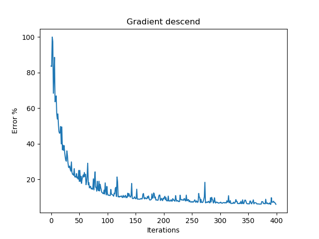

# Perceptron (NN) from scratch: Flower Classification

Repository for the Simple two-way classification Neural Network project. 

"""
Created on Fri Dec 21 22:34:52 2018

The "flower classification problem"is an elementary implementation of a classifier
using only a single neuron and gradient descent optimization, all from scratch. 
No precoded packages such a tensor flow or similar were used. 
win32.com.client was used to make the computer speak (to add a humourous side to it). 
Other packacges include matplotlib, numpy, pandas and random for data manipulation 
and visualization, as well as function implementation. 

The code hass been based on tutorials by giant_neural_network 
on youtube, and further modified so it speaks along the process, reports some stats, 
outputs more visualizations and also has more comments. 
Note that the original data was artificially created, and this beginner example only 
scratches the top of what a real Neural Network implementation looks like. 

Have fun learning!! 

@author: Hair Parra
@Copyright: Attribution-NonCommercial-NoDerivatives 4.0 International
            https://creativecommons.org/licenses/by-nc-nd/4.0/

"""

## Gradient Descent

## Separation Hyperplane

